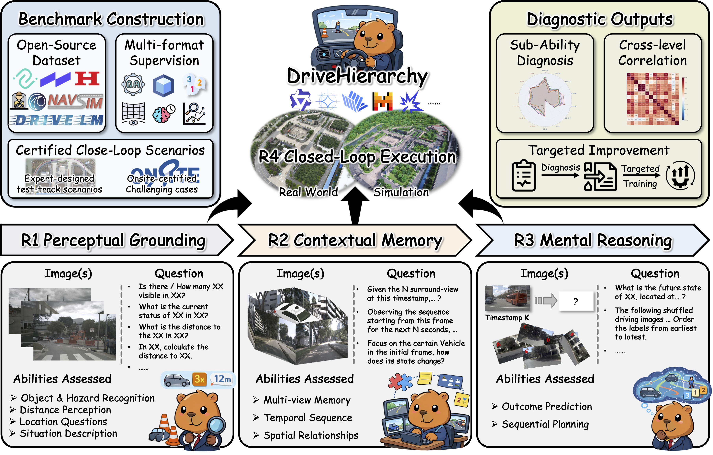
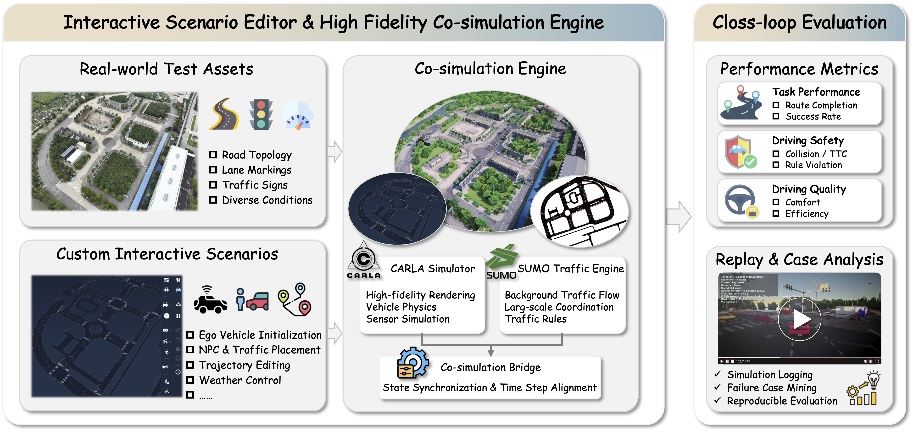
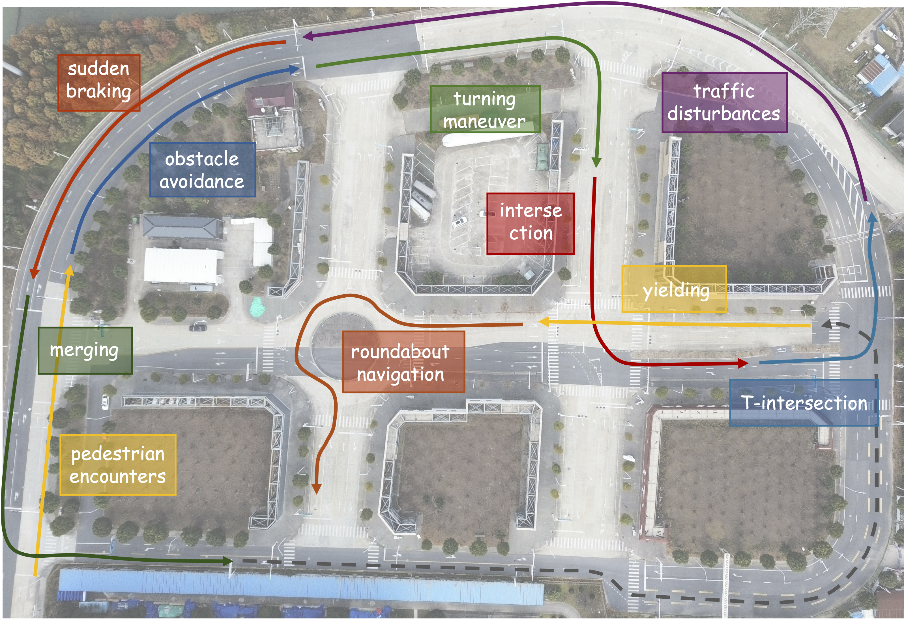
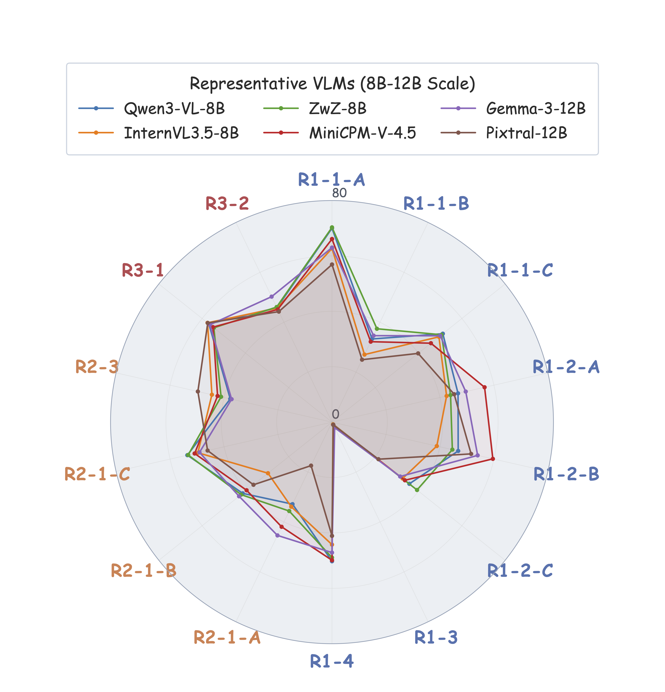
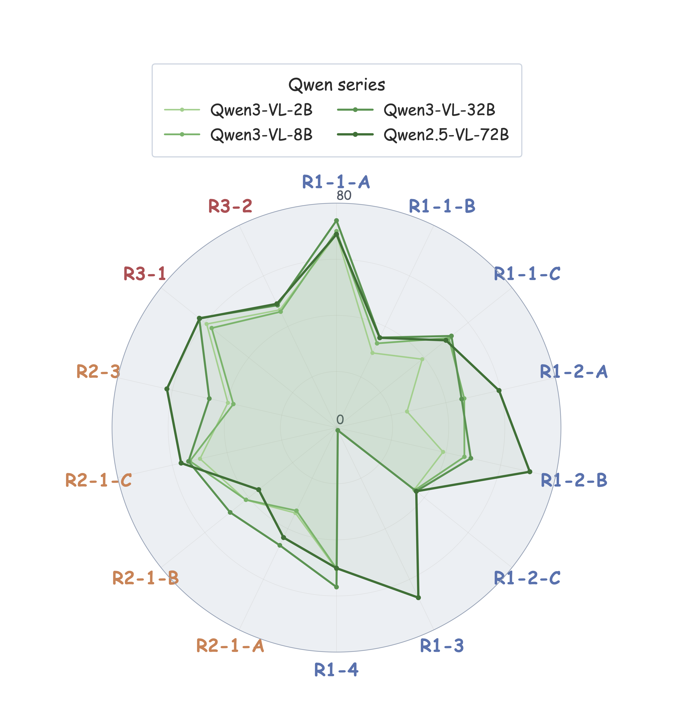
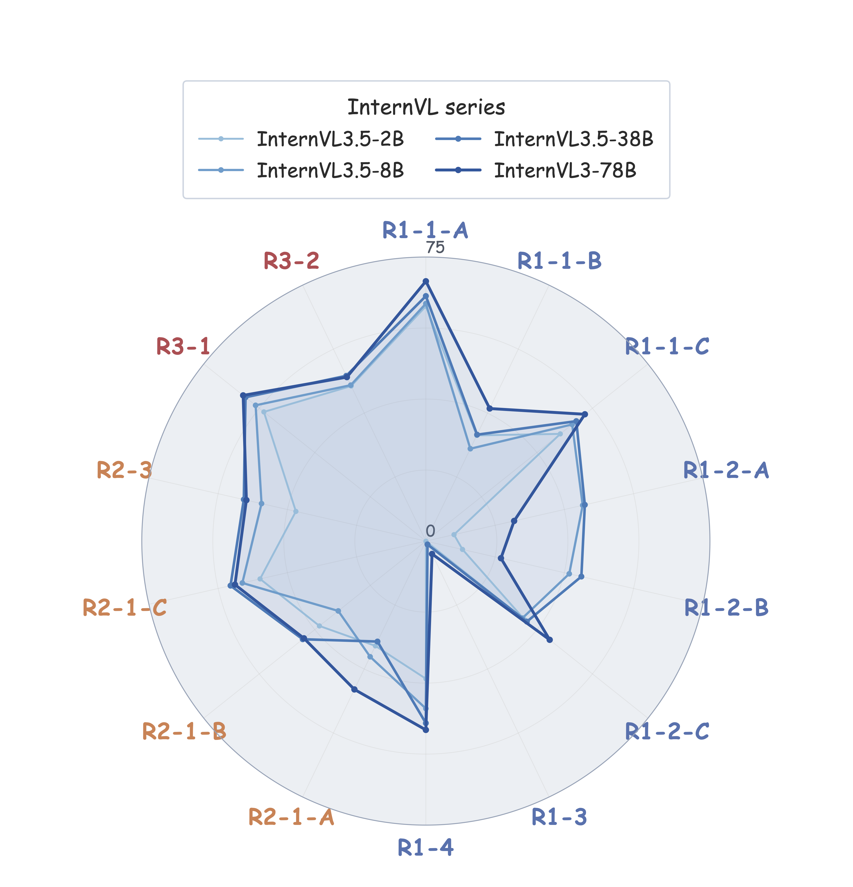

<a id="top"></a>

<div align="center">

<!-- <h1>🚗 DriveHierarchy</h1> -->
<p align="center">
  <a href="assest/Brand.png">
    
  </a>
</p>

<h3>A Benchmark for Diagnosing VLM Driving Capabilities<br>from Open-Loop Understanding to Closed-Loop Execution</h3>

<p><strong>🎉DriveHierarchy is accpeted by NeurIPS 2026!</strong></p>

<p>
  Chengkai Xu<sup>1,</sup> &nbsp; Jiaqi Liu<sup>2,</sup> &nbsp; Yicheng Guo<sup>1,</sup> &nbsp; Peng Hang<sup>1</sup> &nbsp; Jian Sun<sup>1</sup>
</p>
<p>
  <sup>1</sup> Tongji University &nbsp;&nbsp; <sup>2</sup> UNC Chapel Hill<br>
</p>

<p>
  <a href="https://arxiv.org/abs/2609.31814"></a>
  <a href="https://huggingface.co/datasets/ChengkaiXu/DriveHierarchy"></a>
  <a href="docs/evaluation.md"></a>
  <a href="#citation"></a>
</p>

<p><strong>Understand what a driving VLM can do, where it fails, and what to improve.</strong></p>

<p>
  <a href="#highlights">✨ Highlights</a> ·
  <a href="#benchmark">📊 Benchmark</a> ·
  <a href="#scenario-editor">🎨 Scenario Editor</a> ·
  <a href="#key-findings">🔍 Key Findings</a> ·
  <a href="#quick-start">🚀 Quick Start</a> ·
  <a href="#resources">📚 Resources</a> ·
  <a href="#citation">📝 Citation</a>
</p>

</div>

<p align="center">
  <a href="assest/Fig_framework.png">
    
  </a>
</p>
<p align="center"><em>Four capability ranks connect open-loop understanding to interactive driving evaluation.</em></p>

<a id="highlights"></a>

## ✨ Highlights

**DriveHierarchy** is a hierarchical benchmark for diagnosing vision-language models (VLMs) in autonomous driving. It connects fine-grained open-loop assessment with closed-loop simulation to reveal capability strengths, weaknesses, and their relationship to driving behavior.

- 🧩 **Diagnose across four ranks.** Evaluate perceptual grounding, contextual memory, mental reasoning, and closed-loop execution within one capability hierarchy.
- 🎨 **Build your own scenarios, no coding required.** Use the [interactive scenario editor](#scenario-editor) to visually customize ego initialization, surrounding traffic, trajectories, and weather. Design driving interactions around your own research questions without writing scenario scripts.
- 🔗 **Connect understanding to action.** Pair 14 open-loop tasks with 100 interactive scenarios in a CARLA–SUMO co-simulation platform built on a real-world road layout.
- 🎯 **Turn diagnosis into targeted improvement.** Experiments on 15 VLMs and a benchmark-guided fine-tuning case study examine how improvements in open-loop capabilities transfer to closed-loop driving.
- ⚙️ **Run a unified evaluation workflow.** Use model presets, vLLM or Transformers inference, and standardized scoring scripts for reproducible comparisons.

| Capability ranks | Full-corpus QA pairs | Full-corpus frames | Closed-loop scenarios | VLMs studied |
| :--------------: | :------------------: | :----------------: | :-------------------: | :----------: |
|   **4**   |   **76,798**   |  **84,279**  |     **100**     | **15** |

The corpus statistics describe the full benchmark in the [paper](assest/DriveHierarchyNeurIPS.pdf). Reported open-loop results use a refined **14,000-record evaluation set**, with **1,000 records per task**, as specified by the [active dataset catalog](scripts/configs/datasets/open_loop_all.json).

<a id="benchmark"></a>

## 📊 Benchmark

| Rank         | Capability                         | What does it test?                                                                                    | Evaluation                   |
| :----------- | :--------------------------------- | :---------------------------------------------------------------------------------------------------- | :--------------------------- |
| **R1** | 👁️**Perceptual Grounding** | Recognize objects and hazards, estimate distances, localize targets, and describe traffic situations. | 8 open-loop tasks            |
| **R2** | 🧠**Contextual Memory**      | Integrate information across camera views, temporal sequences, and spatial relationships.             | 4 open-loop tasks            |
| **R3** | 💡**Mental Reasoning**       | Predict future outcomes and recover the temporal order of driving observations.                       | 2 open-loop tasks            |
| **R4** | 🚗**Closed-Loop Execution**  | Act under continuous traffic interaction in CARLA–SUMO simulation.                                   | 100 scenarios · 10 families |

<details>
<summary><strong>📋 Explore all 14 open-loop tasks</strong></summary>

| Rank | Task ID    | Task                                  |
| :--- | :--------- | :------------------------------------ |
| R1   | `R1_1_A` | Object existence                      |
| R1   | `R1_1_B` | Object counting                       |
| R1   | `R1_1_C` | State and attribute recognition       |
| R1   | `R1_2_A` | Nearest-object distance               |
| R1   | `R1_2_B` | Referred-object distance              |
| R1   | `R1_2_C` | Distance-bucket estimation            |
| R1   | `R1_3`   | Visual grounding / location questions |
| R1   | `R1_4`   | Situation description                 |
| R2   | `R2_1`   | Multi-view memory                     |
| R2   | `R2_2_A` | Temporal counting                     |
| R2   | `R2_2_B` | Temporal status recognition           |
| R2   | `R2_3`   | Spatial relationships                 |
| R3   | `R3_1`   | Outcome prediction                    |
| R3   | `R3_2`   | Sequential planning                   |

Task files and their full names are available in [Open_Loop_Evaluation](Open_Loop_Evaluation).

</details>

<details>
<summary><strong>🛣️ Explore the 10 closed-loop scenario families</strong></summary>

Pedestrian encounters · Obstacle avoidance · Right turns · Intersections · T-intersections · Traffic flow · Sudden braking · Merging in and out · Yielding at intersections · Roundabouts.

Each scenario includes `entity.json` and `entity_sumo.json` under [Scenario_Onsite](Close_Loop_Evaluation/Scenario_Onsite). Closed-loop scoring combines route completion, safety, and efficiency; see the paper for the metric definition.

</details>

<a id="scenario-editor"></a>

## 🎨 Interactive Scenario Editor

**Your scenario, your design — no programming required.** DriveHierarchy includes a visual, interactive editor for creating custom driving scenarios. Configure the scene and its participants through the interface, from the ego vehicle's starting state to surrounding traffic and their trajectories.

<p align="center">
  <a href="assest/Fig_R4_platform.png">
    
  </a>
</p>
<p align="center"><em>Design custom interactions visually, evaluate them in CARLA–SUMO, and inspect the resulting driving behavior.</em></p>

| What you can customize | Design possibilities |
| :--- | :--- |
| 🚗 **Ego vehicle** | Set the ego vehicle's initial placement and state. |
| 🚶 **Traffic participants** | Place surrounding vehicles, pedestrians, and other dynamic actors to construct your own interactions. |
| 🛣️ **Trajectories** | Edit actor trajectories to build encounters, merging maneuvers, yielding situations, and other driving challenges. |
| 🌦️ **Weather** | Configure weather conditions to explore different driving environments. |

**Create → Simulate → Inspect.** The platform connects scenario design to CARLA's rendering, vehicle physics, and sensors, with SUMO managing background traffic. Simulation logs and replay support failure analysis and further scenario refinement.

### 🗺️ Scenario Coverage

The benchmark provides **100 curated scenarios across 10 families** on a real-world road layout. The editor lets you create additional scenarios tailored to the behaviors you want to investigate.

<p align="center">
  <a href="assest/Fig_Rank_4_distribution.png">
    
  </a>
</p>
<p align="center"><em>Representative scenario types distributed across the test-site road network.</em></p>

Explore the [released scenarios](Close_Loop_Evaluation/Scenario_Onsite) or follow the [closed-loop evaluation guide](docs/evaluation.md#closed-loop-evaluation) to prepare the simulator and run R4.

<a id="key-findings"></a>

## 🔍 Key Findings

The [paper](assest/DriveHierarchyNeurIPS.pdf) studies **15 open-source VLMs**, including generalist and driving-specialized models.

- **Driving capabilities are related but distinct.** R1 and R2 are strongly associated (Spearman ρ = **0.843**), while their associations with R3 are weaker. A single aggregate score can hide meaningful differences between capability profiles.
- **Open-loop understanding is informative about closed-loop behavior.** Correlations with R4 are **0.664** for R1, **0.596** for R2, and **0.418** for R3, motivating evaluation across both settings.
- **Diagnosed weaknesses can guide improvement.** In the Qwen3-VL-8B-Instruct case study, jointly fine-tuning on the identified weak capability groups improves the average R4 score from **0.902 to 8.021**, without using R4 as a supervision target.

These are results under the paper's evaluation protocol; the fine-tuning result is a case study on one base model. See **Tables 1–4** and **Figure 5** for full results and analysis.

### 📈 Capability Profiles at a Glance

The radar plots show how model strengths vary across individual open-loop tasks. The comparison below highlights capability profiles among representative **8B–12B models**.

<p align="center">
  <a href="assest/Fig_radar_midscale_comparison.png">
    
  </a>
</p>
<p align="center"><em>Task-level profiles reveal strengths and weaknesses that an overall score can obscure.</em></p>

<details>
<summary><strong>🔎 Explore Qwen and InternVL model-family comparisons</strong></summary>

<p align="center">
  <a href="assest/Fig_radar_qwen.png"></a>
  <a href="assest/Fig_radar_internvl.png"></a>
</p>
<p align="center"><em>Qwen series (left) and InternVL series (right). Click either plot to view it at full resolution.</em></p>

</details>

The figures use `R2-1-A`, `R2-1-B`, and `R2-1-C` for the tasks named `R2_1`, `R2_2_A`, and `R2_2_B` in the repository, respectively. All three plots assess R1–R3; closed-loop R4 is evaluated separately.

<a id="quick-start"></a>

## 🚀 Quick Start

Start with open-loop evaluation. For CARLA–SUMO setup, scenario selection, output formats, and advanced options, see the **[complete evaluation guide](docs/evaluation.md)**.

### 1. 🛠️ Install

```bash
git clone https://github.com/PerfectXu88/DriveHierarchy.git
cd DriveHierarchy

conda create -n drivehierarchy_openloop python=3.10 -y
conda activate drivehierarchy_openloop
pip install --upgrade pip
pip install -r requirements.txt
```

Run all commands from the repository root. Inference requires a compatible model runtime and sufficient hardware for the selected checkpoint; model-specific dependencies may also be needed.

### 2. 📦 Prepare data and check configuration

Task JSONL files are included in [Open_Loop_Evaluation](Open_Loop_Evaluation). **Prepare the referenced source imagery before inference** and make sure the image paths in the records resolve on your machine. Some records use absolute paths such as `/data/sets/nuscenes/...`; mount the data there or update those references. See [data and environment preparation](docs/evaluation.md#open-loop-environment).

Validate the model preset and dataset selection without loading a model:

```bash
bash scripts/run_open_loop.sh \
  --backend vllm \
  --config qwen3_vl_8b_instruct_vllm \
  --dry-run
```

The dry-run checks configuration and dataset resolution; it does not validate image availability or GPU readiness.

### 3. ▶️ Evaluate and score

```bash
bash scripts/run_open_loop.sh \
  --backend vllm \
  --config qwen3_vl_8b_instruct_vllm \
  --score
```

Predictions are written to `result/open_loop/qwen3_vl_8b_instruct_vllm/`, with the score summary at `evaluation/final_score.json` inside that directory.

**Next steps:** [Choose another model](scripts/configs/models) · [Use Transformers or selected tasks](docs/evaluation.md#open-loop-evaluation) · [Run closed-loop evaluation](docs/evaluation.md#closed-loop-evaluation).

<a id="resources"></a>

## 📚 Resources

| Resource                             | Where to find it                                                             |
| :----------------------------------- | :--------------------------------------------------------------------------- |
| Paper                                | [DriveHierarchy · PDF](assest/DriveHierarchyNeurIPS.pdf)                     |
| Dataset and simulator asset release  | [Hugging Face](https://huggingface.co/datasets/anonymous-2FD5/DriveHierarchy) |
| Installation, inference, and scoring | [Evaluation guide](docs/evaluation.md)                                        |
| Open-loop task records               | [Open_Loop_Evaluation](Open_Loop_Evaluation)                                  |
| Closed-loop scenarios                | [Scenario_Onsite](Close_Loop_Evaluation/Scenario_Onsite)                      |
| Model and runtime presets            | [scripts/configs](scripts/configs)                                            |
| Questions and bug reports            | [GitHub Issues](https://github.com/PerfectXu88/DriveHierarchy/issues)         |

**Closed-loop assets:** `CarlaUE4/` and `HDMaps/` are distributed separately from Git. Restore both under `Close_Loop_Evaluation/Carla_Simulation/` before running R4. See [external asset setup](docs/evaluation.md#external-assets).

<a id="citation"></a>

## 📝 Citation

If DriveHierarchy supports your research, please cite our paper using the following provisional BibTeX entry:

```bibtex
@inproceedings{xu2026drivehierarchy,
  title     = {{DriveHierarchy}: A Benchmark for Diagnosing {VLM} Driving Capabilities from Open-Loop Understanding to Closed-Loop Execution},
  author    = {Xu, Chengkai and Liu, Jiaqi and Guo, Yicheng and Hang, Peng and Sun, Jian},
  booktitle = {Advances in Neural Information Processing Systems},
  year      = {2026},
  url       = {https://github.com/PerfectXu88/DriveHierarchy}
}
```

<a id="license-and-intended-use"></a>

## 📄 License and Intended Use

DriveHierarchy supports non-commercial research on capability measurement, controlled comparison, error analysis, and simulator-based experimentation. The [LICENSE](LICENSE) is the authoritative notice:

- **Original annotations, scenario descriptions, and documentation:** CC BY-NC-SA 4.0.
- **DriveHierarchy-authored source code:** Apache-2.0, unless otherwise stated.
- **Third-party and derived material:** subject to the original source terms, including nuScenes/nuPlan, NAVSIM, Wayve LingoQA, HRI DRAMA, CARLA, SUMO, WOMD-Reasoning, and the Waymo Open Motion Dataset.

<p align="center"><a href="#top">Back to top ↑</a></p>
